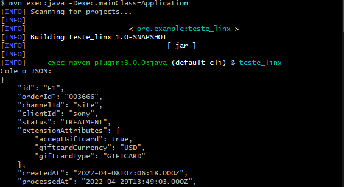
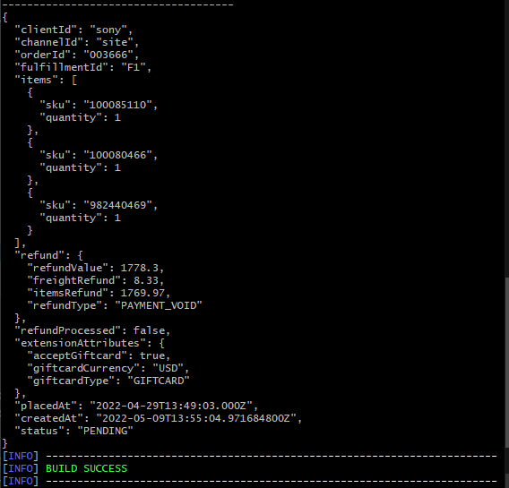
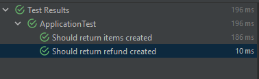

# Teste técnico - Linx

---

## Tecnologias

* Java 11
* Maven 3.6.3
* GSON 2.9.0
* Junit 5.4.0

## Como executar a aplicação?

* 1 - É necessário obter o Maven em sua máquina para realizar o build do projeto
* 2 - Em seguida, descompacte o projeto para o local desejado em sua máquina
* 3 - Abra um terminal(git bash ou command prompt) na raiz do projeto
* 4 - Execute os seguintes comandos:
```
mvn clean install
mvn clean package
mvn compile
```
* 5 - Em seguida, execute a aplicação, com o seguinte comando:

```
mvn exec:java -Dexec.mainClass=Application
```

* 6 - Cole o JSON no terminal:



* 7 - Resultado da saída: RESOLVER SKU


---

### Testes

Os testes são de suma importância para garantir a confiabilidade da aplicação. 
Foram aplicados testes em dois métodos presentes no projeto.



Para rodar os testes via terminal, basta inserir o seguinte comando: 
```
mvn test
```